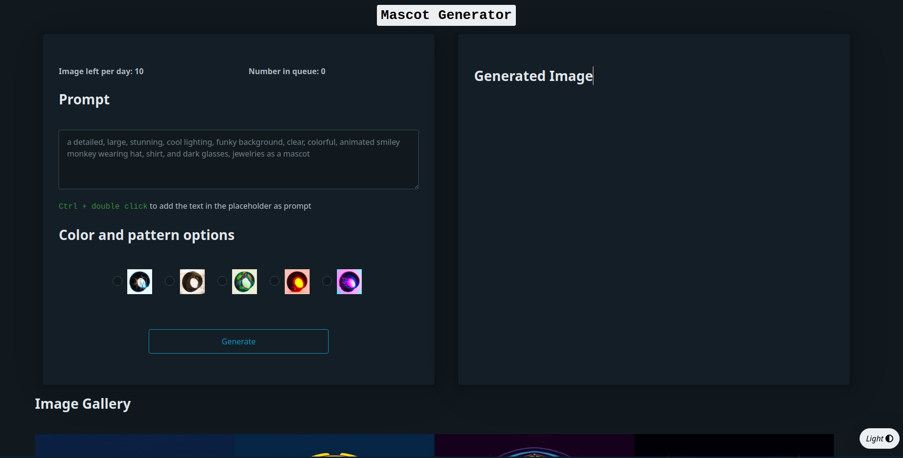

# Mascot Generator

The Mascot Generator is a project that leverages the power of Kandinsky 2.2 to create a text-to-image mascot generator specifically designed for the Mascot Design competitors at One Mount. The project aims to provide a helping hand to individuals who have creative ideas but lack the necessary design skills to bring their mascots to life.

## Table of Contents
1. Overview 
2. Installation and Usage
3. Examples
4. Final thoughts
5. References 

## 1. Overview 

In this project, we have utilized Kandinsky 2.2 [[1]] as the core model for generating desirable mascot images based on user prompts. While we have performed some finetuning on its decoder, due to resource and time constraints, we were unable to finetune its prior model to generate output specific to our custom prompts and company logos.

On the backend side, we have employed SQLite as our database management system, SQLAlchemy for ORM and query mapping, and FastAPI for building APIs. To handle a higher volume of concurrent requests, we have chosen Gunicorn as the backend server, utilizing multiple Uvicorn workers. However, it is worth noting that due to limitations in the CUDA runtime, which does not allow the fork start method, we had to implement FastAPI's sub-API and enable the spawn method with Torch multiprocessing to run the model while simultaneously handling queuing and querying processes [[2]].

For the frontend, we have developed a simple user interface using PicoCSS [[3]] and a few lines of JavaScript to communicate with the backend.


## 2. Installation and Usage 
1. Clone this repository: 

    ```git clone https://github.com/indigoYoshimaru/mascot_generator.git```
2. Install the requirements: 
    
    ```pip install -r requirements.txt```
3. Start the Gunicorn Server: 

    ```gunicorn --workers 4 --preload --worker-class=uvicorn.workers.UvicornWorker backend.main:app```
    
    Go to `localhost:8000/frontend/` and your site should look like this: 

    
4. Start your model by go to `localhost:8000/subapi/docs` > click `Try it out` > click `Execute`

    

    Please remember the model requires up to 12GB VRAM using CUDA runtime, so use it at your own risk. 
5. Have fun!

## 3. Examples
Here are some images of the mascot generated by One Mount employees. For more images, you can view them in the Image Gallery section on web app.


## 4. Final thoughts 

In general, the experience was both amusing and challenging. This project was undertaken by a two-man team and was completed within a span of two days. After serving for two days, we observed that there are a total of 78 users who have generated more than 200 mascots.

Since our web app does not require user login, we have managed user identity using Fingerprint JS [[4]] and FastAPI session [[5]]. However, it is important to note that these methods can sometimes be blocked by ad-blockers and may occasionally result in a mismatch between the frontend and backend sessions.

In conclusion, we acknowledge the drawbacks mentioned earlier and are eager to seize the opportunity to further enhance and address these issues. We aspire for this project to inspire more young individuals to create innovative AI applications that can solve everyday problems in a simple yet creative manner.

 
[1]: https://huggingface.co/docs/diffusers/api/pipelines/kandinsky_v22
[2]: https://pytorch.org/docs/stable/notes/multiprocessing.html#cuda-in-multiprocessing 
[3]: https://picocss.com/
[4]: https://github.com/fingerprintjs/fingerprintjs.git
[5]: https://jordanisaacs.github.io/fastapi-sessions/guide/getting_started/

